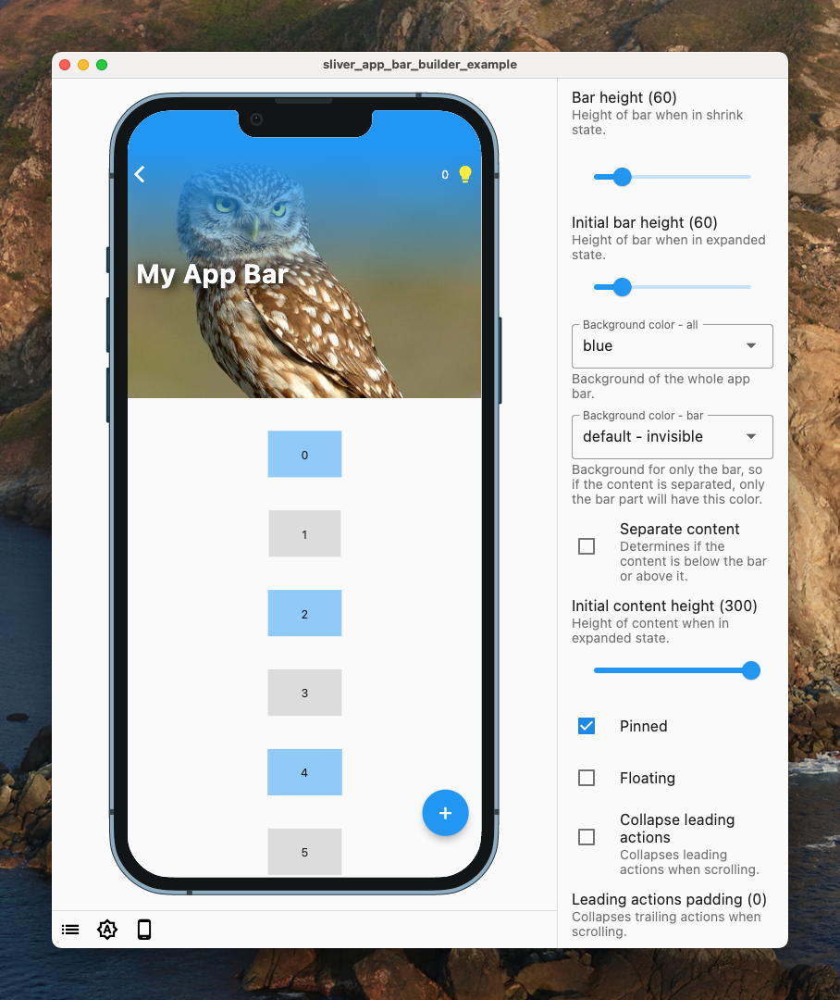

# sliver_app_bar_builder

<picture>
  <source media="(prefers-color-scheme: dark)" srcset="https://raw.githubusercontent.com/netglade/.github/main/assets/netglade_logo_light.png">
  <source media="(prefers-color-scheme: light)" srcset="https://raw.githubusercontent.com/netglade/.github/main/assets/netglade_logo_dark.png">
  
</picture>

Developed with 💚 by [netglade][netglade_link]

[![ci][ci_badge]][ci_badge_link]
[![pub package][pub_badge]][pub_badge_link]
[![license: MIT][license_badge]][license_badge_link]
[![style: netglade analysis][style_badge]][style_badge_link]

---



A truly customizable sliver for app bars with the benefit of using builders.
Check the [`storybook_flutter` demo](example/README.md) in examples and play with the configuration.

## Getting Started

```dart
CustomScrollView(
  slivers: [
    SliverAppBarBuilder(
      barHeight: 60,
      pinned: true,
      contentBuilder: (context, expandRatio, contentHeight, overlapsContent) {
        return Container(
          alignment: Alignment.centerLeft,
          height: 60,
          transform: Matrix4.translationValues(10 + (1 - expandRatio) * 40, expandRatio * 60, 0),
          child: Text(
            knobText,
            style: TextStyle(
              fontSize: knobFontSize + expandRatio * 10,
              color: Colors.white,
              fontWeight: FontWeight.bold,
              shadows: [
                Shadow(
                  color: Color.lerp(Colors.black, Colors.transparent, 1 - expandRatio) ?? Colors.transparent,
                  blurRadius: 10,
                  offset: const Offset(4, 2),
                )
              ],
            ),
          ),
        );
      },
    ),
  ],
);
```

[netglade_link]: https://netglade.cz/en

[ci_badge]: https://github.com/netglade/sliver_app_bar_builder/workflows/ci/badge.svg
[ci_badge_link]: https://github.com/netglade/sliver_app_bar_builder/actions
[license_badge]: https://img.shields.io/badge/license-MIT-blue.svg
[license_badge_link]: https://opensource.org/licenses/MIT
[pub_badge]: https://img.shields.io/pub/v/sliver_app_bar_builder.svg
[pub_badge_link]: https://pub.dartlang.org/packages/sliver_app_bar_builder
[style_badge]: https://img.shields.io/badge/style-netglade_analysis-26D07C.svg
[style_badge_link]: https://pub.dev/packages/netglade_analysis
